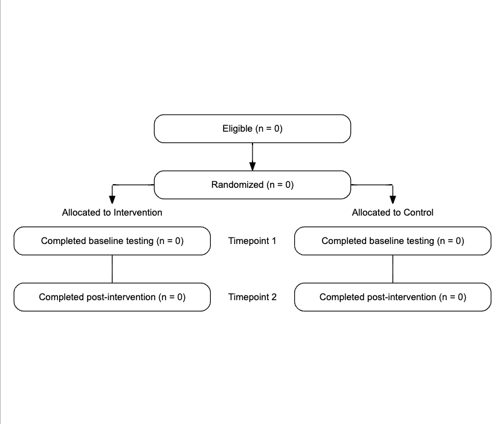
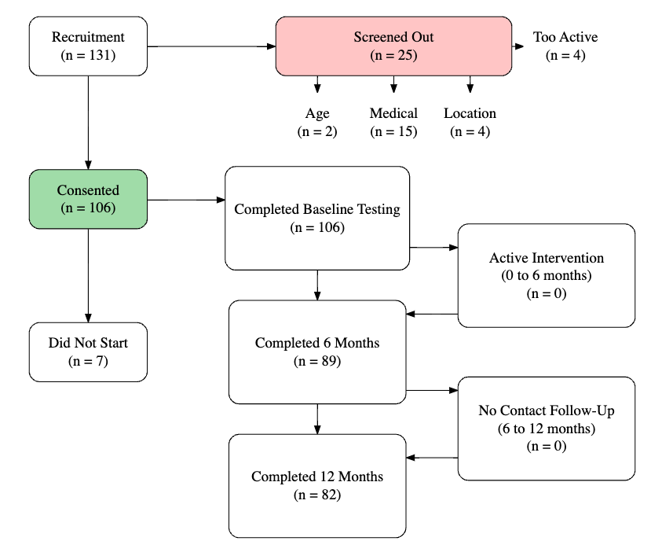

# tidyconsort

<!-- badges: start -->
<!-- badges: end -->

The goal of tidyconsort is to make creating consort diagrams easier with the DiagrammeR package.

## Installation

You can install the development version of tidyconsort like so:

``` r
devtools::install_github("bhelsel/tidyconsort")
```

## Example

This is a basic example of adding nodes and edges:

``` r
library(tidyconsort)

create_graph() |>
  set_node_parameters(shape = "box", fontsize = 12,
                      fontname = "Arial", style = "rounded,filled",
                      fillcolor = "White") |>
  add_node(name = "n1", label = "First Node", pos = c(8, 8)) |>
  add_node(name = "n2", label = "Second Node", pos = c(4, 8)) |>
  set_edge_parameters(arrowhead = "normal", arrowtail = "normal") |>
  add_edge(from = "n1", to = "n2", vebose = TRUE)

```

## Example 1

Here is a template to get started.

``` r

use_template_1(
  eligible = 0,
  randomized = 0,
  timepoints = 2,
  labels = c("Timepoint 1", "Timepoint 2"),
  descriptions = c("Baseline Testing", "Post-intervention"),
  intervention = "Intervention",
  intervention_n = 0,
  control = "Control",
  control_n = 0,
  verbose = FALSE
)

```

  

## Example 2 

You can also read in data with the parameters in a csv file

```r

nodes <- read.csv(system.file("extdata/nodes.csv", package = "tidyconsort"))
edges <- read.csv(system.file("extdata/edges.csv", package = "tidyconsort"))

positions <- unlist(lapply(1:nrow(nodes), function(x) c(nodes$posX[x], nodes$posY[x])))

create_graph(width = 11, height = 10, ratio = "expand") |>
  set_node_parameters(shape = "box", style = "rounded,filled", width = 2) |>
  add_node(name = nodes$name, 
           label = sprintf("%s \n (n = %s)", nodes$label, nodes$n), 
           pos = positions, fillcolor = nodes$fillcolors, color = nodes$colors, 
           width = nodes$width, height = nodes$height,
           fontsize = 18) |>
  add_edge(from = edges$from, to = edges$to)


```




